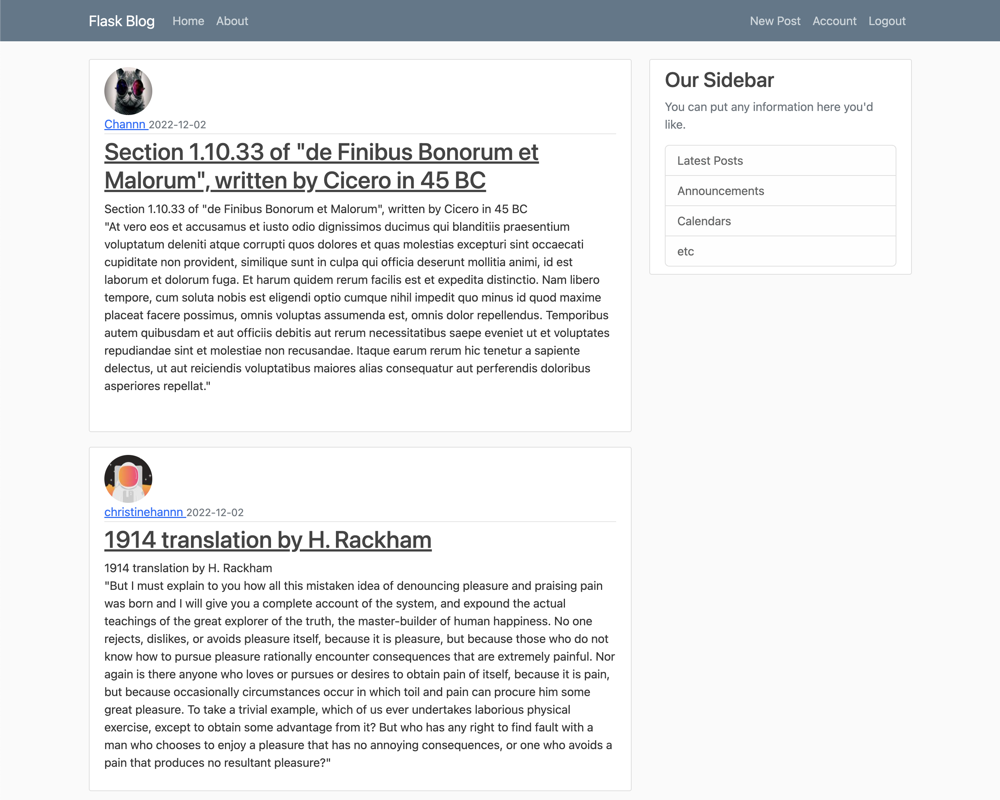

# crispy-flaskblog
Web application that allows users to create a profile, upload, and edit blog posts.

## Technology Stack
Python 
Flask framework 
HTML/CSS/Bootstrap 

## License
[MIT](LICENSE) © Christine Han
